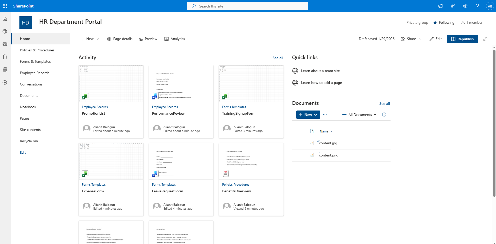
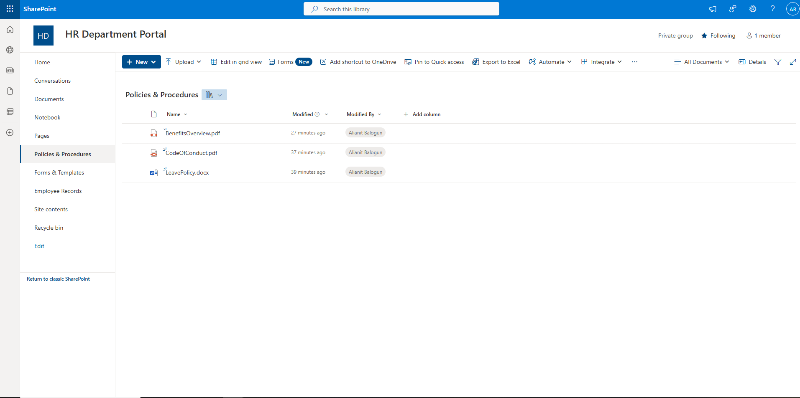
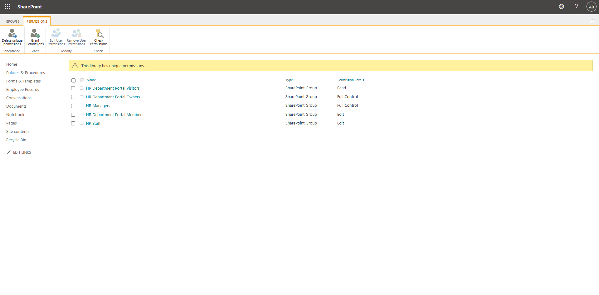
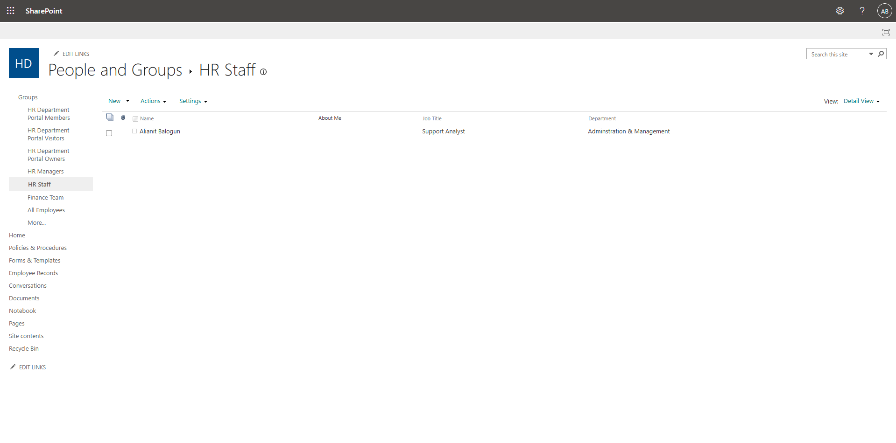
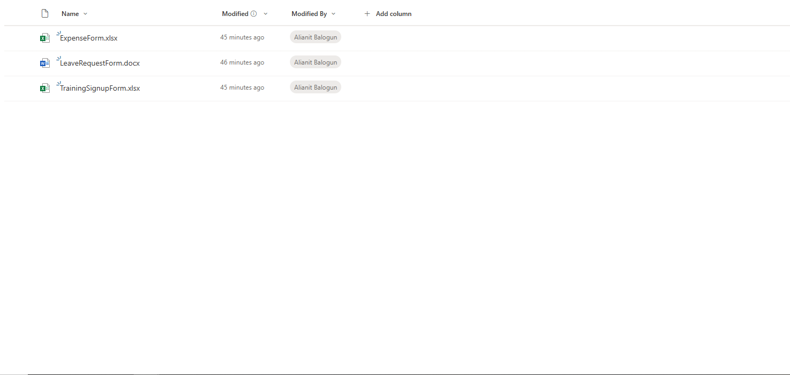

# Sharepoint-permission-management
A SharePoint site demonstrating role-based permissions and secure file access for HR and Finance teams.

## Purpose
- Practice core SharePoint Admin tasks.
- Demonstrate understanding of security and access management.
- Show recruiters I can protect company data and manage user access.

## Site Structure
- **HR Department Portal**
  - Policies & Procedures (Sensitive)
  - Forms & Templates (General)
  - Employee Records (Highly Sensitive)
  
    
## Roles & Permissions

| Library                  | HR Manager | HR Staff | Finance Team | All Employees |
|---------------------------|------------|---------|--------------|---------------|
| Policies & Procedures     | Full       | Edit    | Read         | None          |
| Forms & Templates         | Full       | Edit    | Read         | Read          |
| Employee Records          | Full       | Edit    | None         | None          |

## Step-by-Step Build

1. **Created SharePoint Site**
   

2. **Created Document Libraries**
   

3. **Configured Unique Permissions**
   

4. **Created SharePoint Groups**
   

5. **Uploaded Sample Files**
   

6. **Tested Access**
   
   
## Outcome
- Role-based permissions work correctly.
- Sensitive HR data is protected.
- Demonstrates core SharePoint admin skills.
